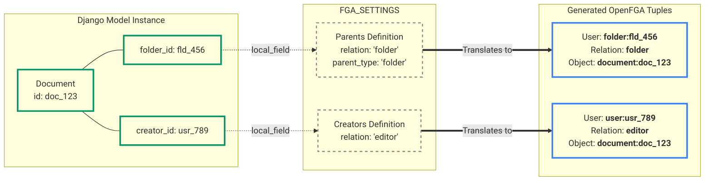

# Syncing Models to OpenFGA

To synchronize a Django model with OpenFGA, simply inherit from `AuthzSyncMixin` and define your `FGA_SETTINGS` dictionary. The package handles everything else automatically.

### Example: Defining Cascading Inheritance & Roles

```python
# models.py
from django.db import models
from authz_data_sync.mixins import AuthzSyncMixin
from typing import ClassVar

class Organization(AuthzSyncMixin, models.Model):
    name = models.CharField(max_length=255)
    creator_id = models.UUIDField()

    FGA_SETTINGS: ClassVar[dict] = {
        "object_type": "organization",
        "parents": [], # Top level entity (or link to platform if desired)
        "creators": [
            {"relation": "admin", "local_field": "creator_id"}
        ]
    }

class Folder(AuthzSyncMixin, models.Model):
    name = models.CharField(max_length=255)
    organization_id = models.UUIDField()
    creator_id = models.UUIDField()

    FGA_SETTINGS: ClassVar[dict] = {
        "object_type": "folder",
        "parents": [
            {
                "relation": "organization", 
                "parent_type": "organization", 
                "local_field": "organization_id"
            }
        ],
        "creators": [
            {"relation": "owner", "local_field": "creator_id"}
        ]
    }

class Document(AuthzSyncMixin, models.Model):
    title = models.CharField(max_length=255)
    content = models.TextField()
    folder_id = models.UUIDField()
    creator_id = models.UUIDField()

    FGA_SETTINGS: ClassVar[dict] = {
        "object_type": "document",
        "parents": [
            {
                "relation": "folder", 
                "parent_type": "folder", 
                "local_field": "folder_id"
            }
        ],
        "creators": [
            {"relation": "editor", "local_field": "creator_id"}
        ]
    }
```

Whenever you call `Document.objects.create()`, `document.save()`, or `document.delete()`, the mixin will automatically calculate the graph diffs, queue the tuples in the local Outbox table, and trigger the Celery worker to push them to OpenFGA asynchronously.

---

## 1. The Tuple Mapping (Graph)
This diagram shows how the `FGA_SETTINGS` dictionary acts as a translation layer, reading soft-reference `UUIDs` from your Django Model and converting them into strict Zanzibar Tuples.



---

## 2. The Transactional Outbox Lifecycle (Sequence)
This diagram illustrates the underlying superpower of the `AuthzSyncMixin`. It shows why calling `.save()` is 100% reliable, protecting your system against network failures to the OpenFGA server.


---

## 3. Overriding the Rules & Custom Logic

If you need to inject custom business logic or manipulate tuples in the middle of the process, you have three clean "escape hatches" depending on where the data originates.

### Method 1: The Model Level (Overriding `_generate_authz_tuples`)

If the custom role assignment is tied directly to the data state of the model (for example, making a document "Public" based on a boolean field), you should intercept the package's tuple generator directly in your `models.py`.

The `AuthzSyncMixin` relies on a method called `_generate_authz_tuples()`. You can simply call `super()` to get the standard tuples, manipulate the list, and return it!

```python
# models.py
from django.db import models
from authz_data_sync.mixins import AuthzSyncMixin
from typing import ClassVar

class Document(AuthzSyncMixin, models.Model):
    title = models.CharField(max_length=255)
    folder_id = models.UUIDField()
    creator_id = models.UUIDField()
    
    # Let's say we have a custom boolean field
    is_public = models.BooleanField(default=False) 

    FGA_SETTINGS: ClassVar[dict] = { ... standard config ... }

    def _generate_authz_tuples(self) -> list[dict]:
        # 1. Grab the standard tuples generated by the Mixin's FGA_SETTINGS
        tuples = super()._generate_authz_tuples()
        
        # 2. Inject your custom, dynamic logic!
        if self.is_public:
            tuples.append({
                "user": "user:*",                 # OpenFGA wildcard for "everyone"
                "relation": "reader",             # The role to assign
                "object": f"document:{self.id}"   # This specific document
            })
            
        return tuples
```
> **Note:** Because the mixin automatically calculates diffs on `.save()`, if you change `is_public` from True to False, the mixin will automatically issue a `DELETE` action for that tuple!

### Method 2: The View Level (Using DRF `perform_create`)

If the custom role assignment comes from the HTTP Request (for example, a user selects 3 co-workers in a dropdown to co-author a document), you should handle this in the DRF View using `perform_create`.

You can do this by manually writing to the package's `FGASyncOutbox` table. Because DRF wraps `perform_create` in a transaction by default, this remains 100% atomic and safe.

```python
# views.py
from rest_framework import viewsets
from authz_data_sync.permissions import IsFGAAuthorized
from authz_data_sync.models import FGASyncOutbox  # Import the Outbox model!

from .models import Document
from .serializers import DocumentSerializer

class DocumentViewSet(viewsets.ModelViewSet):
    queryset = Document.objects.all()
    serializer_class = DocumentSerializer
    permission_classes = [IsFGAAuthorized]
    # ... standard fga variables ...

    def perform_create(self, serializer):
        # 1. Save the document normally. 
        # (This triggers the Model Mixin to queue the creator/parent tuples)
        raw_user_id = self.request.fga_user.replace("user:", "")
        document = serializer.save(creator_id=raw_user_id)

        # 2. Extract dynamic data from the POST payload
        # e.g., payload contains: {"title": "My Doc", "extra_editors": ["uuid1", "uuid2"]}
        extra_editors = self.request.data.get("extra_editors", [])

        # 3. Manually queue custom tuples into the Outbox!
        for editor_id in extra_editors:
            FGASyncOutbox.objects.create(
                action=FGASyncOutbox.Action.WRITE,
                user_id=f"user:{editor_id}",
                relation="editor",
                object_id=f"document:{document.id}"
            )
            
        # Once the view finishes returning the HTTP Response, the database commits,
        # and Celery sweeps up BOTH the mixin's tuples and your custom tuples at the same time!
```

### Method 3: Direct Outbox Manipulation (The "Escape Hatch")

Sometimes, you need to assign a role completely outside the standard Model creation lifecycle. For example, you are building an "Invite User" view where an existing `Organization` admin invites a new user as a `manager`. 

Because you aren't calling `Organization.objects.create()`, the `AuthzSyncMixin.save()` method won't help you. In this case, you can interact directly with the `FGASyncOutbox` model to queue your own custom tuples. 

The Celery worker sweeps the Outbox entirely independently of how the records got there!

```python
from rest_framework.views import APIView
from rest_framework.response import Response
from authz_data_sync.models import FGASyncOutbox

class InviteManagerAPIView(APIView):
    def post(self, request, org_id):
        new_manager_id = request.data.get("user_id")
        
        # 1. Validate the current user has permission to invite (using get_fga_client)
        # ... validation logic ...

        # 2. Manually queue the new Role Assignment directly into the Outbox!
        FGASyncOutbox.objects.create(
            action="WRITE",
            user_id=f"user:{new_manager_id}",
            relation="manager",
            object_id=f"organization:{org_id}"
        )
        # The transaction.on_commit hook is generally tied to the mixin, 
        # so for raw creation, you can manually trigger the Celery worker to wake up immediately:
        from authz_data_sync.tasks import process_fga_outbox_batch
        process_fga_outbox_batch.delay()

        return Response({"status": "User invited and FGA graph updated!"})
```

!!! tip "Which method should you use?"
    * Use **Method 1 (Model Override)** if the authorization rule depends on the fields *inside* the database row (like an `is_public` or `status` field).
    * Use **Method 2 (View `perform_create`)** if the authorization rule depends on external data passed by the user in the API request that isn't saved directly to the model.
    * Use **Method 3 (Escape Hatch)** when assigning roles without creating or mutating a model instance (e.g., inviting a user to a resource).