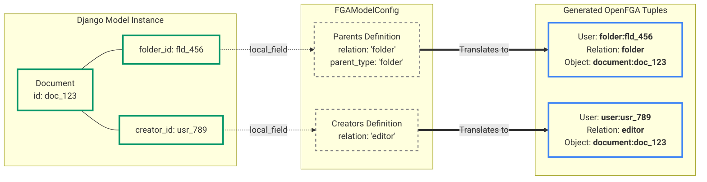
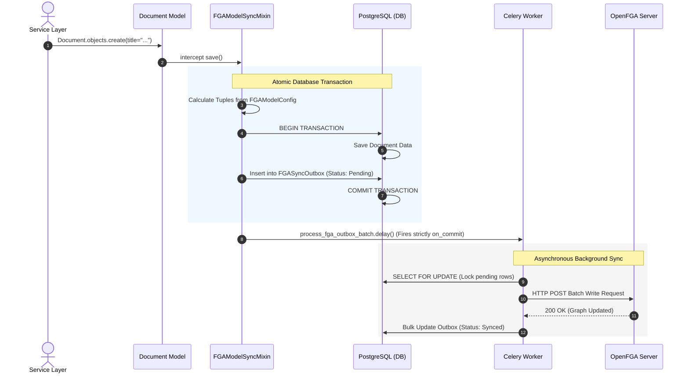

# Syncing Models to OpenFGA

To synchronize a Django model with OpenFGA, simply inherit from `FGAModelSyncMixin` and define your `fga_config` using the `FGAModelConfig` dataclass. The package handles everything else automatically.
## The "Ownership" Rule: When to use the Mixin

Before adding the `FGAModelSyncMixin` to your models, you must ask one architectural question: **Does this specific mini-app "own" this data?**

In a distributed microservice environment, you will interact with two types of data: data you *own* (Source of Truth) and data you *borrow* (External Context).

### When to USE the Mixin
> Source of Truth

You **MUST** use the `FGAModelSyncMixin` when your mini-app is the authoritative creator of a resource.
When a user creates this object in your app, OpenFGA needs to know about it instantly so it can assign the creator their roles.

* **Example:** The Finance App owns `Invoice` and `Expense` records.
* **Action:** You attach the mixin to the `Invoice` model. When `invoice.save()` is called, the mixin writes `user:alice -> owner -> invoice:123` to the OpenFGA graph.

### When NOT to use the Mixin
> Borrowed Context

You **MUST NOT** use the `FGAModelSyncMixin` for resources that your mini-app merely references but does not natively create or manage.

* **Example:** The Finance App groups invoices by `Organization`. The central "Core Identity" service owns the `Organization` data, not the Finance App.
* **Action:** If you create a read-only `Organization` table in your Finance database (or just store `organization_id` strings), **do not attach the mixin to it**. If you did, saving an organization in the Finance app might accidentally overwrite or conflict with the Core service's FGA tuples!
* **How to authorize it:** To check permissions against borrowed context, completely bypass your local models and use [Stateless Views](stateless-views.md) (e.g., `lookup_header="HTTP_X_CONTEXT_ORG_ID"`).

!!! tip "The Architect's Summary"
    * **Writing to the Graph:** Use `FGAModelSyncMixin` on models your app explicitly creates.
    * **Reading from the Graph:** Use `FGAViewConfig(lookup_header=...)` on endpoints that check permissions against external parents.

### Example: Defining Cascading Inheritance & Roles

*Assume the following code lives in the Central Core service (which **owns** Organizations) and the Document service (which **owns** Folders and Documents).*

```python
# models.py
from django.db import models
from fga_data_sync.mixins import FGAModelSyncMixin
from fga_data_sync.structs import FGAModelConfig, FGAParentConfig, FGACreatorConfig
from typing import ClassVar

class Organization(FGAModelSyncMixin, models.Model):
    name = models.CharField(max_length=255)
    creator_id = models.UUIDField()

    fga_config: ClassVar[FGAModelConfig] = FGAModelConfig(
        object_type="organization",
        creators=[
            FGACreatorConfig(
                relation="admin",
                local_field="creator_id"
            )
        ]
    )

class Folder(FGAModelSyncMixin, models.Model):
    name = models.CharField(max_length=255)
    organization_id = models.UUIDField()
    creator_id = models.UUIDField()

    fga_config: ClassVar[FGAModelConfig] = FGAModelConfig(
        object_type="folder",
        parents=[
            FGAParentConfig(
                relation="organization",
                parent_type="organization",
                local_field="organization_id"
            )
        ],
        creators=[
            FGACreatorConfig(
                relation="owner",
                local_field="creator_id"
            )
        ]
    )

class Document(FGAModelSyncMixin, models.Model):
    title = models.CharField(max_length=255)
    content = models.TextField()
    folder_id = models.UUIDField()
    creator_id = models.UUIDField()

    fga_config: ClassVar[FGAModelConfig] = FGAModelConfig(
        object_type="document",
        parents=[
            FGAParentConfig(
                relation="folder",
                parent_type="folder",
                local_field="folder_id"
            )
        ],
        creators=[
            FGACreatorConfig(
                relation="editor",
                local_field="creator_id"
            )
        ]
    )
```

Whenever you call `Document.objects.create()`, `document.save()`, or `document.delete()`, the mixin will automatically calculate the graph diffs, queue the tuples in the local Outbox table, and trigger the Celery worker to push them to OpenFGA asynchronously.

---

## 1. The Tuple Mapping (Graph)
This diagram shows how the `FGAModelConfig` dataclass acts as a translation layer, reading soft-reference `UUIDs` from your Django Model and converting them into strict Zanzibar Tuples.



---

## 2. The Transactional Outbox Lifecycle (Sequence)
This diagram illustrates the underlying superpower of the `FGAModelSyncMixin`. It shows why calling `.save()` is 100% reliable, protecting your system against network failures to the OpenFGA server.



---

## 3. Overriding the Rules & Custom Logic

If you need to inject custom business logic or manipulate tuples in the middle of the process, you have three clean "escape hatches" depending on where the data originates.

### Method 1: The Model Level
> Overriding `save`

If the custom role assignment is tied directly to the data state of the model (for example, making a document "Public" based on a boolean field), you should intercept the `save()` method. Because we use the Outbox pattern, you can queue tuples manually using `self._queue_outbox`.

```python
# models.py
from django.db import models
from fga_data_sync.mixins import FGAModelSyncMixin
from fga_data_sync.models import FGASyncOutbox
from fga_data_sync.structs import FGAModelConfig

class Document(FGAModelSyncMixin, models.Model):
    title = models.CharField(max_length=255)
    folder_id = models.UUIDField()
    creator_id = models.UUIDField()

    # Let's say we have a custom boolean field
    is_public = models.BooleanField(default=False)

    fga_config = FGAModelConfig(...) # Define standard config here

    def save(self, *args, **kwargs):
        # 1. Let the mixin handle the standard config-based tuples
        super().save(*args, **kwargs)

        # 2. Inject your custom, dynamic logic!
        if self.is_public:
            self._queue_outbox(
                action=FGASyncOutbox.Action.WRITE.value,
                t={
                    "user": "user:*",                 # OpenFGA wildcard for "everyone"
                    "relation": "reader",             # The role to assign
                    "object": f"document:{self.pk}"   # This specific document
                }
            )
```
> **Note:** Because the mixin automatically calculates diffs based on the original state versus the new state, custom manual tuples like the one above will need to be manually deleted if `is_public` reverts to `False`.

### Method 2: The View Level
> Using DRF `perform_create`

If the custom role assignment comes from the HTTP Request (for example, a user selects 3 co-workers in a dropdown to co-author a document), you should handle this in the DRF View using `perform_create`.

You can do this by manually writing to the package's `FGASyncOutbox` table. Because DRF wraps `perform_create` in a transaction by default, this remains 100% atomic and safe.

```python
# views.py
from rest_framework import viewsets
from fga_data_sync.permissions import IsFGAAuthorized
from fga_data_sync.models import FGASyncOutbox  # Import the Outbox model!

from .models import Document
from .serializers import DocumentSerializer

class DocumentViewSet(viewsets.ModelViewSet):
    queryset = Document.objects.all()
    serializer_class = DocumentSerializer
    permission_classes = [IsFGAAuthorized]
    # ... standard fga_config variables ...

    def perform_create(self, serializer):
        # 1. Save the document normally.
        # (This triggers the Model Mixin to queue the creator/parent tuples)
        raw_user_id = self.request.fga_user.replace("user:", "")
        document = serializer.save(creator_id=raw_user_id)

        # 2. Extract dynamic data from the POST payload
        # e.g., payload contains: {"title": "My Doc", "extra_editors": ["uuid1", "uuid2"]}
        extra_editors = self.request.data.get("extra_editors", [])

        # 3. Manually queue custom tuples into the Outbox!
        for editor_id in extra_editors:
            FGASyncOutbox.objects.create(
                action=FGASyncOutbox.Action.WRITE.value,
                user_id=f"user:{editor_id}",
                relation="editor",
                object_id=f"document:{document.id}"
            )

        # Once the view finishes returning the HTTP Response, the database commits,
        # and Celery sweeps up BOTH the mixin's tuples and your custom tuples at the same time!
```

### Method 3: Direct Outbox Manipulation (The "Escape Hatch")

Sometimes, you need to assign a role completely outside the standard Model creation lifecycle (for example, inviting an existing user to an Organization). Because you aren't calling `.save()` on a configured model, you can write relationships directly to the FGA Graph by utilizing the `FGASyncOutbox`.

👉 **See the [Role Assignments Guide](../schema/role-assignments.md) for full code examples on how to dynamically assign roles via Views, Scripts, or M2M tables.**
