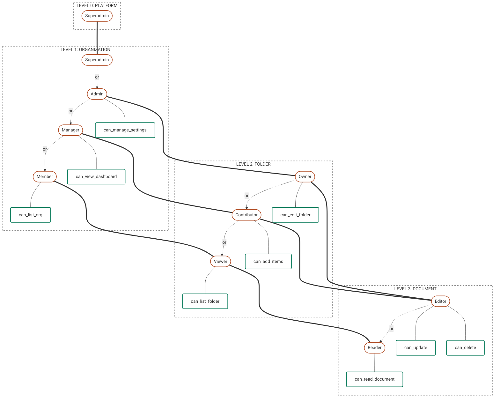

# 🏗️ Designing the OpenFGA Schema (DSL)

To get the most out of `django-authz-data-sync`, your OpenFGA schema must follow the **Roles vs. Permissions Pattern**.

This is an industry-standard Zanzibar architecture that completely decouples your application's security logic from your Python code. By strictly separating **who a user is** from **what a user can do**, you can change business rules on the fly without ever deploying new Django code.

## The Core Philosophy

Every `type` in your OpenFGA DSL should be split into three distinct sections:

1. **Structural Links:** How does this object relate to its parent?
2. **Roles (The "Who"):** The titles users hold (`owner`, `editor`, `reader`). These are assigned by your Django **Models**.
3. **Permissions (The "What"):** The actions users can take (`can_list_org`, `can_read_document`). These are checked by your Django **Views**.

## Complete Example: Cascading Hierarchy

Here is the definitive schema design for a cascading hierarchy (`Platform` -> `Organization` -> `Folders` -> `Documents`). Notice how roles cascade downwards, and permissions strictly check those roles.

```yaml
model
  schema 1.1

type user

# ==========================================
# LEVEL 0: THE GLOBAL PLATFORM
# ==========================================
type platform
  relations
    define superadmin: [user]

# ==========================================
# LEVEL 1: ORGANIZATION
# ==========================================
type organization
  relations
    # 1. Structural Link
    define platform: [platform]

    # 2. Roles (Cascading linearly!)
    define superadmin: [user] or superadmin from platform
    define admin: [user] or superadmin
    define manager: [user] or admin
    define member: [user] or manager

    # 3. Permissions (Checked by Django Views)
    define can_manage_settings: admin
    define can_view_dashboard: manager
    define can_list_org: member

# ==========================================
# LEVEL 2: FOLDER
# ==========================================
type folder
  relations
    # 1. Structural Link
    define organization: [organization]

    # 2. Roles (Inheriting from the Organization)
    define owner: [user] or admin from organization
    define contributor: [user] or manager from organization or owner
    define viewer: [user] or contributor or member from organization

    # 3. Permissions (Checked by Django Views)
    define can_edit_folder: owner
    define can_add_items: contributor
    define can_list_folder: viewer

# ==========================================
# LEVEL 3: DOCUMENT
# ==========================================
type document
  relations
    # 1. Structural Link
    define folder: [folder]

    # 2. Roles (Inheriting from the Folder)
    define editor: [user] or owner from folder or contributor from folder
    define reader: [user] or editor or viewer from folder

    # 3. Permissions (Checked by Django Views)
    define can_update: editor
    define can_delete: editor
    define can_read_document: reader
```


### Visualize the DSL schema



## Rules for Django Integration

### Rule 1: Models only assign ROLES.

When configuring a Django Model's `FGA_SETTINGS`, the `creators` list must only assign base **Roles** (like `editor` or `owner`). Models should never directly assign permissions.

```python
# ❌ BAD: Assigning a permission directly
"creators": [{"relation": "can_update", "local_field": "creator_id"}]

# ✅ GOOD: Assigning a role
"creators": [{"relation": "editor", "local_field": "creator_id"}]
```

### Rule 2: Views only check PERMISSIONS.

When configuring a DRF View's `FGA_VIEW_SETTINGS` (or using custom APIViews), the configuration must only check **Permissions** (like `can_read_document` or `can_update`). Views should never check roles.

```python
# ❌ BAD: Checking a role directly
FGA_VIEW_SETTINGS = {
    "list_relation": "reader",
    "detail_relations": {"PUT": "editor"}
}

# ✅ GOOD: Checking a permission
FGA_VIEW_SETTINGS = {
    "list_relation": "can_read_document",
    "detail_relations": {"PUT": "can_update"}
}
```
